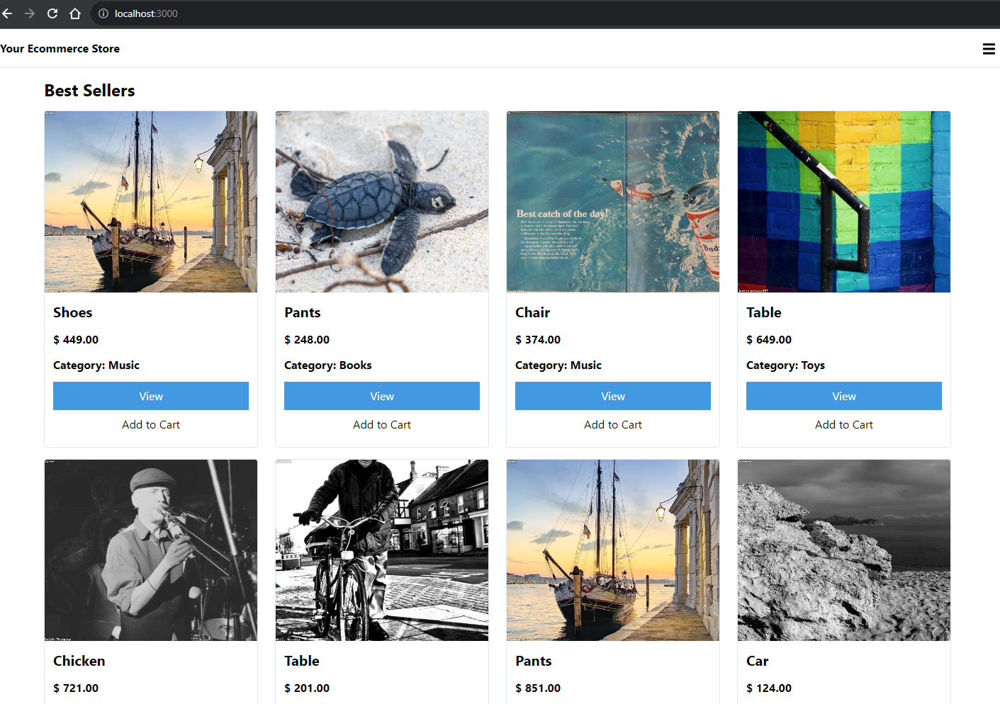
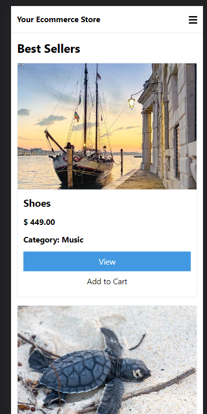

# ReactJS Store

Start Project

git clone https://github.com/GeorgiZlatev/ReactStore.git

cd ReactStore

npm install --global yarn

yarn --version

yarn add postcss-cli@7.1.0

yarn add autoprefixer@9.7.5

yarn build:css

export NODE_OPTIONS=--openssl-legacy-provider

yarn start

  <label>Desktop View</label>
  

 

  <label>Mobile View</label> 
  

